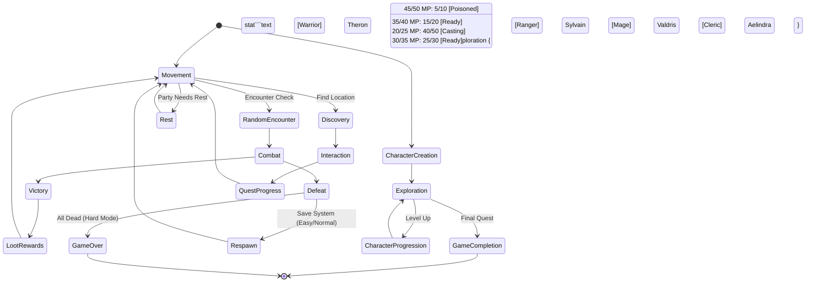
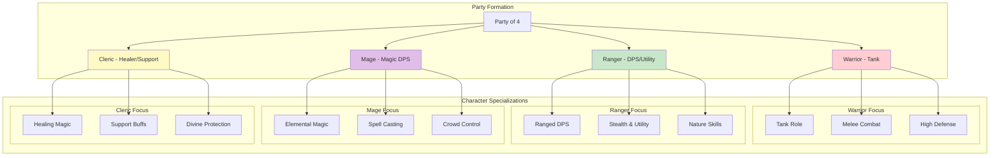
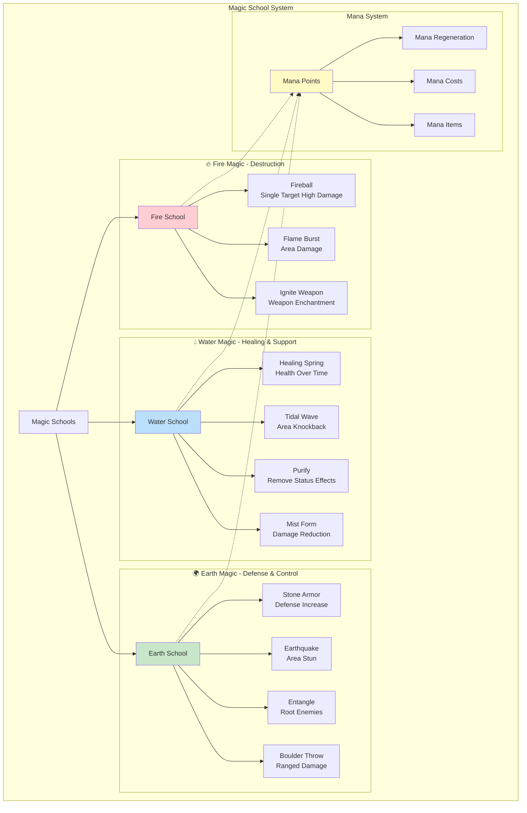

# Core Mechanics - Land of Mist RPG

## Purpose

Define the fundamental gameplay systems that drive the Land of Mist RPG experience, including combat, character progression, economy, and party management.

## Game Overview

A text-based, turn-based RPG set in a Mythral-inspired fantasy world featuring party-based combat, tactical decision-making, and character progression.

### Core Game Loop



## Core Systems

### 1. Party System

#### Requirements

- Manage a party of exactly 4 characters
- Each character has distinct classes and abilities
- Party formation affects combat tactics
- Character synergies and combinations

#### Design

- **Party Composition**: 4 distinct character slots



- **Character Classes**:
  - **Warrior**:
    - Melee combat specialist, high defense
    - **Armor**: Heavy armor proficiency
    - **Weapons**: All melee weapons, shields (especialy one-handed + shield combinations)
    - **Preferred**: Sword/shield, great sword, great axe
  - **Ranger**:
    - Ranged combat, stealth abilities, nature skills
    - **Armor**: Light to medium armor proficiency
    - **Weapons**: Bows, crossbows, knives, spears, one-handed weapons
    - **Preferred**: Bow, knife combinations, light weapons for mobility
  - **Mage**:
    - Spell casting, elemental magic, low physical defense
    - **Armor**: Light armor only (robes, cloth)
    - **Weapons**: Staffs, knives (for emergencies)
    - **Preferred**: Staff for spell focus and mana regeneration
  - **Cleric**:
    - Healing, support magic, moderate combat ability
    - **Armor**: Light to medium armor proficiency
    - **Weapons**: One-handed weapons, shields, staffs, some two-handed weapons
    - **Preferred**: Mace/shield combination, healing staff
- **Party Roles**:
  - Tank (front-line defense)
  - DPS (damage dealers)
  - Support (healing/buffs)
  - Utility (special abilities)

#### Dependencies

- Character creation system
- Class progression system
- Equipment management

### 2. Currency System

#### Requirements

- Three-tier currency system with automatic conversion
- Realistic economic progression
- Clear value representation in UI

#### Design

- **Currency Tiers**:
  - **Copper Coins**: Base currency (1-99 copper)
  - **Silver Coins**: Mid-tier (1 silver = 100 copper)
  - **Gold Coins**: High-tier (1 gold = 100 silver = 10,000 copper)
- **Auto-Conversion**: Automatic promotion (100 copper → 1 silver)
- **Display Format**: "2g 15s 47c" (gold/silver/copper)
- **Economic Balance**:
  - Starting equipment: 5-50 copper
  - Basic weapons/armor: 1-10 silver
  - Medium armor and shields: 5-20 silver
  - Heavy armor and magic items: 1-5 gold
  - Epic weapons and enchanted gear: 10+ gold
  - Poison vials and consumables: 50 copper - 2 silver

#### Dependencies

- Inventory system
- Shop/trading system
- Loot generation

### 3. Combat System

#### Requirements

- Turn-based tactical combat
- Weapon type advantages/disadvantages
- Magic system integration
- Status effects and conditions

#### Design

- **Turn Order**: Initiative-based (Dexterity + dice roll)
- **Combat Actions**:
  - Attack (weapon-based)
  - Cast Spell (magic-based)
  - Use Item (consumables)
  - Defend (damage reduction)
  - Special Abilities (class-specific)
- **Weapon Types**:
  - **One-Handed Weapons**:
    - **Swords**: Balanced damage, versatile, parry bonus, can use with shield
    - **Axes (1H)**: High damage, armor penetration, can use with shield
    - **Knives**: Fast attacks, high critical chance, can be thrown, stealth bonus
  - **Two-Handed Weapons**:
    - **Great Swords**: Very high damage, sweeping attacks, no shield use
    - **Great Axes**: Massive damage, armor destruction, slow but devastating
    - **Spears**: Medium damage, reach advantage, formation bonus, thrust attacks
    - **Staffs**: Magic focus, spell damage bonus, mana regeneration, light physical damage
  - **Ranged Weapons**:
    - **Bows**: Ranged damage, requires ammunition, critical hit bonus, two-handed
    - **Crossbows**: High damage, slower reload, armor penetration, two-handed
- **Weapon Enhancements**:
  - **Poisonous Weapons**: Can be coated with various toxins
    - **Basic Poison**: Damage over time for 3 turns
    - **Paralytic Poison**: Chance to stun target for 1 turn
    - **Weakening Poison**: Reduces target's strength for 5 turns
    - **Deadly Poison**: High damage over time, expensive and rare
  - **Enhancement Application**:
    - Poison coatings have limited uses (3-5 applications per vial)
    - Can be applied during combat preparation or between fights
    - Different weapon types have varying poison effectiveness
    - Knives and arrows are most effective with poison coatings
  - **Poison Resistance**: Some enemies may be immune or resistant
- **Armor System**:
  - **Light Armor**:
    - Low defense bonus, no movement penalty
    - Suitable for: Rangers, Mages
    - Examples: Leather armor, robes, cloth garments
    - Allows full dexterity and spellcasting mobility
  - **Medium Armor**:
    - Moderate defense bonus, slight movement penalty
    - Suitable for: Clerics, hybrid classes
    - Examples: Chain mail, studded leather, reinforced robes
    - Balance between protection and mobility
  - **Heavy Armor**:
    - High defense bonus, significant movement penalty
    - Suitable for: Warriors, Paladins
    - Examples: Plate mail, full plate, heavy chain
    - Maximum protection at cost of speed and stealth
- **Shield System**:
  - **Bucklers**: Small shield, minor defense bonus, allows weapon flexibility
  - **Round Shields**: Medium defense, good for one-handed weapon users
  - **Tower Shields**: High defense, requires strength, blocks ranged attacks
  - **Magic Shields**: Spell resistance, mana-based abilities
  - **Shield Mechanics**:
    - Can only be used with one-handed weapons
    - Provides block chance against physical attacks
    - Some shields offer elemental resistance
    - Active blocking consumes stamina but increases defense
- **Damage Calculation**:

  ```text
  Base Damage = Weapon Damage + Attribute Modifier
  Armor Reduction = Armor Defense + Shield Block (if applicable)
  Final Damage = Base Damage - Armor Reduction + Critical Multiplier
  Poison Damage = Applied separately each turn (bypasses armor)

  Special Cases:
  - Two-handed weapons: +25% damage bonus
  - Armor penetration weapons: Ignore portion of armor
  - Shield block: Chance-based additional defense
  ```

#### Dependencies

- Character attribute system
- Equipment system
- Magic system
- Poison and status effect system

### 4. Magic System

#### Requirements

- Elemental magic types with distinct effects
- Mana/resource management
- Spell progression and learning

#### Design

- **Magic Schools**:
  - **Fire Magic** (Destruction & Offense):
    - Fireball: Single target, high damage, burn effect (damage over time)
    - Flame Burst: Area damage, lower per-target damage, ignites flammables
    - Ignite Weapon: Enchant weapon with fire damage for several turns
  - **Water Magic** (Healing & Support):
    - Healing Spring: Restore health over multiple turns to target
    - Tidal Wave: Area knockback effect, moderate damage, extinguishes fires
    - Purify: Remove negative status effects, poisons, and curses
    - Mist Form: Reduce incoming damage for one turn, increase dodge
  - **Earth Magic** (Defense & Control):
    - Stone Armor: Increase defense significantly, reduce movement speed
    - Earthquake: Area damage with chance to stun and knock prone
    - Entangle: Root enemies in place, prevent movement and actions
    - Boulder Throw: Long-range single target damage, ignores some armor



- **Mana System**:
  - Each character has Mana Points (MP)
  - Spells consume MP based on power level
  - MP regenerates slowly per turn or via items/rest
- **Spell Components**:
  - Verbal (speaking) - can be silenced
  - Material (components) - can be consumed
  - Somatic (gestures) - can be restricted

#### Dependencies

- Character magic attributes
- Status effect system
- Resource management

### 5. Character Progression

#### Requirements

- Experience-based leveling system
- Attribute growth and customization
- Skill specialization paths

#### Design

- **Core Attributes**:
  - **Strength**: Melee damage, carrying capacity
  - **Dexterity**: Initiative, ranged accuracy, dodge
  - **Intelligence**: Mana pool, spell damage, magic resistance
  - **Constitution**: Health points, poison resistance
  - **Wisdom**: Mana regeneration, spell accuracy
  - **Charisma**: Trade prices, party leadership
- **Leveling System**:
  - Experience points from combat and quest completion
  - Level cap: 20 (allows for focused progression)
  - Each level: +1 to primary attribute, +health/mana
- **Skill Trees**: Class-specific advancement paths
  - Combat specializations
  - Magic school mastery
  - Utility abilities

#### Dependencies

- Experience point system
- Class definition system
- Equipment requirements

### 6. Difficulty System

#### Difficulty Requirements

- Three distinct difficulty levels for different player skill levels
- Comprehensive scaling affecting all game systems
- Meaningful choices with trade-offs between challenge and accessibility

#### Difficulty Design

- **Difficulty Levels**:
  - **Easy Mode - "Apprentice"**:
    - Target audience: New RPG players, casual gamers
    - Player advantages: +25% damage dealt, 20% less damage received
    - Enemy scaling: -10% health, -20% damage output
    - Progression benefits: +20% experience gain, +10% better loot
    - Quality of life: Save on death, no permadeath, -20% encounter frequency
    - Boss mechanics: Gentler phase transitions (70%/35% health thresholds)
  - **Normal Mode - "Adventurer"**:
    - Target audience: Standard RPG experience
    - Balanced gameplay: All systems at intended 1.0 multiplier
    - Standard progression: Normal experience and loot rates
    - Classic features: Save on death, no permadeath
    - Boss mechanics: Standard phase transitions (65%/30% health thresholds)
  - **Hard Mode - "Legend"**:
    - Target audience: Experienced players seeking maximum challenge
    - Player disadvantages: -15% damage dealt, +30% damage received
    - Enemy scaling: +20% health, +30% damage output
    - Progression penalties: -10% experience, -5% loot quality
    - Hardcore features: No save on death, permadeath enabled, +30% encounter frequency
    - Boss mechanics: Aggressive phase transitions (60%/25% health thresholds)

- **System-Wide Impact**:
  - **Combat**: Damage multipliers, health scaling, encounter frequency
  - **Progression**: Experience gain rates, attribute point allocation
  - **Economy**: Loot quality modifiers, item availability
  - **Save System**: Permadeath mechanics, death handling
  - **Boss Encounters**: Phase transition timing, ability availability

- **Permadeath Mechanics** (Hard Mode Only):
  - Character death is permanent and irreversible
  - Dead characters lose all equipment and progression
  - Party size reduction affects combat capabilities
  - Game over occurs when all characters are dead
  - No resurrection items or revival mechanics

- **Difficulty Selection**:
  - Chosen at game start before character creation
  - Cannot be changed during gameplay to maintain integrity
  - Saved with game data for consistency
  - Visual indicators throughout UI to remind player of current difficulty

#### Difficulty Dependencies

- Combat system for damage calculations
- Progression system for experience scaling
- Save system for permadeath and death handling
- UI system for difficulty indicators and selection

## UI/UX Requirements

### Text-Based Interface Design

- **Font**: Medieval/fantasy serif font (e.g., Cinzel, Trajan Pro)
- **Color Scheme**:
  - Background: Dark brown/black parchment texture
  - Text: Cream/gold for readability
  - Highlights: Green for positive, red for negative
- **Layout Sections**:
  - Party status (health, mana, conditions)
  - Current scene description
  - Available actions
  - Inventory/equipment quick view
  - Message log

### Information Display

- **Party Status Panel**:

  ```
  [Warrior] Aragorn    HP: 45/50  MP: 5/10   [Poisoned]
  [Ranger]  Legolas    HP: 35/40  MP: 15/20  [Ready]
  [Mage]    Gandalf    HP: 20/25  MP: 40/50  [Casting]
  [Cleric]  Elrond     HP: 30/35  MP: 25/30  [Ready]
  ```

- **Currency Display**: Gold: 2 | Silver: 15 | Copper: 47
- **Combat Log**: Scrolling text of recent actions and results

## Technical Considerations

### Data Storage

- Character data in ScriptableObjects
- Save/load system for game state
- Modular design for easy balancing

### Performance

- Text-based interface for fast rendering
- Minimal graphics processing requirements
- Efficient state management

### Extensibility

- Plugin architecture for new classes/spells
- Data-driven equipment and magic systems
- Mod support considerations

## Success Metrics

- Combat encounters feel tactical and engaging
- Character progression provides meaningful choices
- Party composition creates strategic depth
- Economic system feels balanced and rewarding
